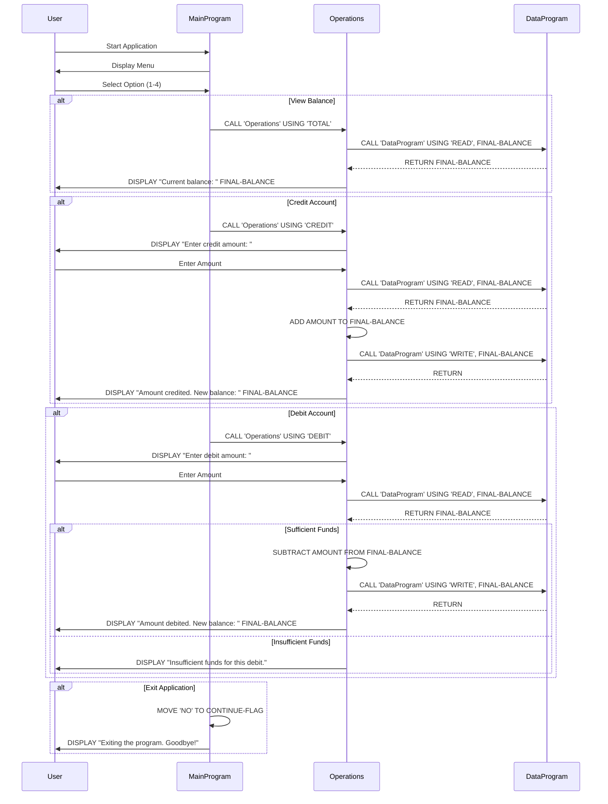

# Modernizing a COBOL Accounting System to a Node.js Application

This repository demonstrates the end-to-end modernization of a legacy COBOL accounting system into a Node.js application using [Devin](https://devin.ai), an AI software engineering agent.


## Project Overview

The original COBOL application is a simple account management system supporting credit, debit, and balance operations. It has been fully converted to a modular Node.js application with:

- Complete 1:1 file-for-file migration preserving business logic
- 26 automated tests (unit + integration) with 100% coverage on business logic
- Docker containerization with multi-stage builds
- CI/CD pipeline via GitHub Actions
- Deployment scripts for development, staging, and production
- PowerPoint presentation documenting the migration process

## Repository Structure

```
.
├── main.cob                  # Legacy COBOL - Main menu (original)
├── operations.cob            # Legacy COBOL - Business logic (original)
├── data.cob                  # Legacy COBOL - Data persistence (original)
├── TESTPLAN.md               # Test plan for business logic validation
├── node-app/                 # Modernized Node.js application
│   ├── src/
│   │   ├── main.js           # CLI entry point (converted from main.cob)
│   │   ├── operations.js     # Business logic (converted from operations.cob)
│   │   └── data.js           # Data persistence (converted from data.cob)
│   ├── tests/
│   │   ├── unit/             # Unit tests for each module
│   │   └── integration/      # End-to-end workflow tests
│   ├── scripts/
│   │   ├── deploy.sh         # Deployment automation script
│   │   └── generate_presentation.py  # PowerPoint generator
│   ├── docs/
│   │   ├── ARCHITECTURE.md   # Architecture documentation
│   │   └── COBOL_to_NodeJS_Migration.pptx  # Migration presentation
│   ├── Dockerfile            # Container build
│   └── package.json          # Node.js project manifest
├── .github/workflows/ci.yml  # CI/CD pipeline (GitHub Actions)
└── .devcontainer/            # Dev container configuration
```

## About the Legacy COBOL Program

The COBOL program simulates an account management system using multiple source files performing operations like crediting, debiting, viewing the balance, and exiting:

- **Main Program (main.cob):** Handles the user interface and calls subprograms for different operations.
- **Operations Program (operations.cob):** Handles the actual operations like credit, debit, and view balance.
- **Data Storage Program (data.cob):** Manages the storage of the account balance.

### Running the COBOL Version

Install GnuCOBOL:

```bash
# macOS
brew install gnucobol

# Ubuntu/Debian
sudo apt-get update && sudo apt-get install gnucobol
```

Compile and run:

```bash
cobc -x main.cob operations.cob data.cob -o accountsystem
./accountsystem
```

## Running the Node.js Version

### Prerequisites

- Node.js 18+
- npm 9+
- Docker (optional, for containerized deployment)

### Quick Start

```bash
cd node-app
npm install
npm start
```

### Running Tests

```bash
cd node-app
npm test              # All tests with coverage
npm run test:unit     # Unit tests only
npm run test:integration  # Integration tests only
npm run lint          # ESLint
```

## Program Interaction Example

Both the COBOL and Node.js versions produce identical output:

```bash
--------------------------------
Account Management System
1. View Balance
2. Credit Account
3. Debit Account
4. Exit
--------------------------------
Enter your choice (1-4): 
```

- **View Balance:** `Current balance: 1000.00`
- **Credit:** `Enter credit amount: 200.00` → `Amount credited. New balance: 1200.00`
- **Debit:** `Enter debit amount: 300.00` → `Amount debited. New balance: 900.00`
- **Insufficient Funds:** `Insufficient funds for this debit.`
- **Exit:** `Exiting the program. Goodbye!`

## Modernization Process

The migration was performed by Devin following these steps:

### 1. Analysis & Planning
- Analyzed the COBOL source files to understand module boundaries and data flow
- Identified the modular architecture (main → operations → data)
- Mapped COBOL constructs to Node.js equivalents

### 2. File-for-File Conversion

| COBOL File | Node.js Module | Key Conversion |
|------------|---------------|----------------|
| `main.cob` | `src/main.js` | `ACCEPT` → `readline-sync`, `EVALUATE` → `switch` |
| `operations.cob` | `src/operations.js` | `CALL 'DataProgram'` → `require('./data')`, `PIC 9(6)V99` → `Math.round(x*100)/100` |
| `data.cob` | `src/data.js` | `WORKING-STORAGE` → module-scoped variable |

### 3. Test Creation
- Generated unit tests from `TESTPLAN.md` business scenarios
- Added integration tests for multi-operation workflows
- Verified arithmetic precision matches COBOL's fixed-point behavior

### 4. Deployment Infrastructure
- Created Dockerfile with multi-stage Alpine build and non-root user
- Built deployment script supporting dev/staging/production environments
- Set up GitHub Actions CI/CD with Node 18/20 matrix testing

### 5. Documentation
- Architecture documentation with design decisions
- PowerPoint presentation (10 slides) covering the full migration journey

## Architecture & Data Flow



## Deployment

```bash
cd node-app

# Development (runs directly)
./scripts/deploy.sh development

# Staging (Docker container)
./scripts/deploy.sh staging

# Production (build, push to registry, deploy)
DOCKER_REGISTRY=ghcr.io/your-org ./scripts/deploy.sh production
```

See [node-app/scripts/deploy.sh](node-app/scripts/deploy.sh) for the full deployment pipeline with environment validation, testing, and container orchestration.

## Key Design Decisions

| Decision | Rationale |
|----------|-----------|
| `readline-sync` for I/O | Matches COBOL's synchronous terminal behavior |
| In-memory data storage | Mirrors COBOL's working-storage; production would use a database |
| `Math.round(x*100)/100` | Replicates `PIC 9(6)V99` fixed-point precision |
| Functions return objects | Enables unit testing without mocking `console.log` |
| Docker multi-stage build | Minimal image size, non-root user, health checks |

## License

This project is licensed under the MIT License - see the [LICENSE](LICENSE) file for details.
