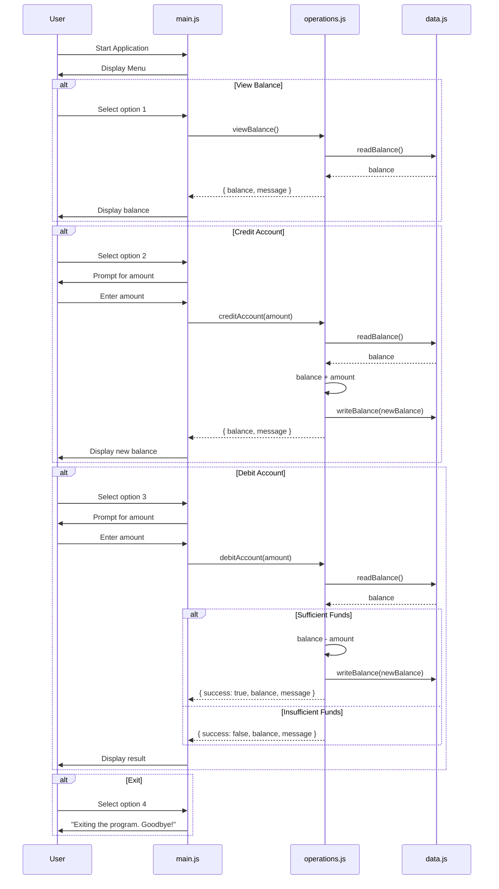

# Architecture Documentation

## Overview

The Account Management System has been modernized from a legacy COBOL application to a Node.js application while preserving the original modular structure and business logic.

## Module Structure

```
node-app/
├── src/
│   ├── main.js          # Entry point - CLI menu (was main.cob)
│   ├── operations.js    # Business logic (was operations.cob)
│   └── data.js          # Data persistence layer (was data.cob)
├── tests/
│   ├── unit/            # Unit tests per module
│   └── integration/     # End-to-end workflow tests
├── scripts/
│   ├── deploy.sh        # Deployment automation
│   └── generate_presentation.py  # PPTX generator
├── docs/
│   ├── ARCHITECTURE.md  # This file
│   └── COBOL_to_NodeJS_Migration.pptx
├── .github/workflows/
│   └── ci.yml           # CI/CD pipeline
├── Dockerfile           # Container build
└── package.json         # Project manifest
```

## COBOL-to-Node.js Mapping

| COBOL File       | Node.js File       | Responsibility                     |
|------------------|--------------------|------------------------------------|
| `main.cob`       | `src/main.js`      | User interface and menu loop       |
| `operations.cob` | `src/operations.js`| Credit, debit, view balance logic  |
| `data.cob`       | `src/data.js`      | Balance read/write persistence     |

## Data Flow

```
User Input → main.js → operations.js → data.js → (in-memory store)
                ↑                          |
                └──────── response ────────┘
```

### Sequence Diagram



## Key Design Decisions

### 1. File-for-File Migration
Each COBOL source file maps to exactly one Node.js module, preserving the original separation of concerns.

### 2. Fixed-Point Arithmetic
COBOL uses `PIC 9(6)V99` for two-decimal fixed-point. The Node.js version rounds all calculations to 2 decimal places using `Math.round(x * 100) / 100` to prevent floating-point drift.

### 3. Synchronous I/O
The original COBOL program uses synchronous terminal I/O. The Node.js version uses `readline-sync` to match this behavior, keeping the migration faithful to the original UX.

### 4. Testability
Functions return result objects `{ balance, message }` instead of printing directly, enabling unit testing without mocking `console.log`.

### 5. Initial Balance
The COBOL program initializes `STORAGE-BALANCE` to `1000.00`. The Node.js version replicates this with `INITIAL_BALANCE = 1000.00` in the data module.

## Deployment Options

| Environment | Method                  | Command                              |
|-------------|-------------------------|--------------------------------------|
| Development | Direct Node.js          | `npm start`                          |
| Staging     | Docker container        | `./scripts/deploy.sh staging`        |
| Production  | Docker + registry push  | `./scripts/deploy.sh production`     |

## CI/CD Pipeline

GitHub Actions workflow (`.github/workflows/ci.yml`):
1. **Lint & Test** — Runs on Node.js 18 and 20 in parallel
2. **Docker Build** — Verifies container builds successfully

Triggers on pushes and pull requests to `main` for changes in `node-app/`.

## Technology Stack

- **Runtime**: Node.js 18+ (LTS)
- **Testing**: Jest 29 with coverage
- **Linting**: ESLint 8
- **Containerization**: Docker (multi-stage Alpine build)
- **CI/CD**: GitHub Actions
